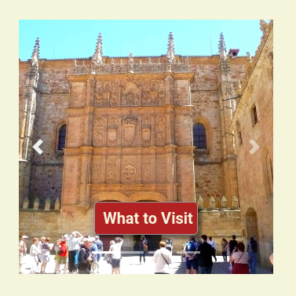
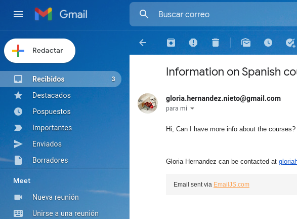
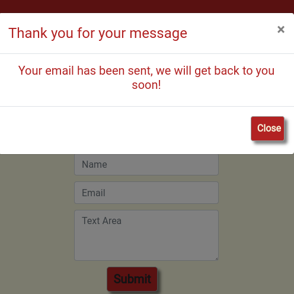

# Living Salamanca (Interactive Frontend Development Milestone Project)

[Deployed website]( https://gloria-21.github.io/Living-Salamanca/)
## Purpose of the project

The purpose of this project is to create a website that offers a different holidays experience learning Spanish in the historical city of Salamanca (Spain). Salamanca has one of the oldest universities in Europe and it hosts the Spanish department where all the DELE exams are produced and marked. Also, I have added other features on the website to help to know and enjoy the city such what to visit, eating, and shopping.
## User stories

This project has been designed with someone that is interested in learning Spanish in mind, that is our ideal end-user. The expected scope of people attending these courses is to be in the range of 18 to 30 years old.

* As an international student, I want to know the different educational centers on offer and which ones adapt better to my necessities
* As an international student, I will find useful some basic information about the city such as acommodation or where to eat
* As an international student, I will like to learn about the culture of a different country and the rich history of Salamanca
## Features

* **Navbar**

The navbar gives a friendly user experience as links the homepage, the activity section, and the Contact-us page.

Also on the mobile version, it can be found on the top right corner as a burger button that collapses, giving a better UX experience.

* **Carousel**

Right underneath the hero image, the carousel with all different activities is located. This is a visual feature that keeps the attention of the user and invites to click the buttons to discover more about those activities.

* **Map section**

The carousel is linked to the Map section through an event listener. This section expands on the different activities shown on the carousel which have a icon-button.
This button display the makers clusters dropping into a map

* **Contact-us page**

This page is is presenting a form that is linked via Email Js to an email, so every time that user sends a message, we will receive an email. At the same time that user will see a pop up modal informing of the success of the message.

* **Footer**

Each page has on the footer has links to social media. Those links are connected to real pages of the city of Salamanca
## Future features

* In the future, when the time doesn't constrain, I want to add infoWindow to the markers so they will have a description on them and a possible link to websites if that is feasible.

## Desing

* **Logo**

    I have chosen a globe as a logo for this website as it represents the diversity of nationalities that you can find in Salamanca. Also, it represents the openness of a city that traditionally has been welcoming international students since medieval times.
    The logo for this website has been created using [Canva](https://www.canva.com/design/play?category=tACZCvjI6mE)

* **Typography**

    The font use on the website has been chosen from [Google Fonts](https://fonts.google.com/). I have chosen Lato for the Navbar and headers and Roboto for the body

* **Colour Scheme**

    The colour scheme for the website follows the Salamanca University tradition. 
    I have chosen the #beige as it is similar to the typical golden sandstone that can be found on the historical buildings in Salamanca, and the #firebrick as it is similar to the ink that you can see on those walls. What it can be seen in there is the word "Vitor" (Victory) with the students initial after they were graduated. These ink was made originally with bull's blood, hence the red color.

    For the hovering effect I decided to go for #FFB91C as it contrast quite nicely against the #firebrick

    To create this palette I have used [coolors](https://coolors.co/)

    

## Wireframe

The wireframes that can be found below have been created using Balsamiq during the Scope plane part of the design and planning process of this project.

* [Desktop Wireframe](https://share.balsamiq.com/g/3CRFBJYQPkeL1Hw5sZ3YEx.png)

* [Mobile Wireframe](https://share.balsamiq.com/g/afyQrvqW1pGHFpbXXqTQpy.png)

There are few elements that have changed if you compare the original wireframe with the actual project. I decided to simplify the navbar, but all in all the essence of the original idea is still there
## Technologies used

As it follows below
### Languages used
* [HTML5](https://en.wikipedia.org/wiki/HTML5) 

* [CSS3](https://en.wikipedia.org/wiki/CSS)

* [JavaScript](https://en.wikipedia.org/wiki/JavaScript)
### Frameworks, Libraries & Programs Used

1. [Bootstrap 4.6](https://getbootstrap.com/docs/4.6/getting-started/introduction/)

    I have used Bootstrap to help with the responsiveness of the website as well as the styling

2. [Google Font](https://fonts.google.com/)

    I have used Google font to import the fonts Lato and Roboto into my style.css file, which is being used on all pages throughout the project

3. [Font Awesome](https://fontawesome.com/)

    Used for the icons on this website

4. [Balsamiq](https://balsamiq.com/)

    I used Balsamiq to create the wireframing during the design process

5. [Git](https://git-scm.com/)

    Git was used for version control by utilizing the Gitpod terminal to commit to Git and Push to GitHub

6. [Github](https://github.com/Gloria-21/Living-Salamanca)

    I used GitHub to store the project's code after being pushed from Gitpod

7. [TinyPNG](https://tinypng.com/)

    I used TinyPNG to compress images making them load faster

8. [Google Maps Platform](https://developers.google.com/maps/documentation/javascript/examples/marker-animations-iteration?hl=en)

## Testing

I have done the testing for my website using the dev tools on google chrome. I have been testing regularly checking that the results were the expected on different sizes, from mobile devices to desktop and tablet, making sure the website was responsive in all of them.
I used this tool as a main source to implement my code, trying the functionality and styling effects there first and adding them to my code afterward.

At a later stage, when the site was deployed, the website was tested by family and friends who looked on different devices and gave feedback on responsitivity and user experience.

### Validator testing

To check the validity of the codes I have used [W3C Markup Validation](https://validator.w3.org/), [W3C CSS Validation](https://jigsaw.w3.org/css-validator/) and [JS Hint](https://jshint.com/)

* Index.html page has passed the validator with no error [index.html](/doc/validators/indexvalidator.png)
* CONTACT-US.HTML
* Style.css page has passed the validation with 0 errors [style.css](/doc/validators/CSSValidator.png)

### Performance

To check the website performance level as well as the speed I used [Google lighthouse](https://developers.google.com/web/tools/lighthouse)
## Test user stories

## Fixed bugs

This preyect has been quite challenging from the very beginning as JavaScript is a new is a brand new language and I wasn't confident with it.

* The carusel, has been quite challenging as it is a feature that I have never used before. I decided to have a button on each slide of the carousel and link it to the section right below it so it would have the visual element from the slide and also an explanation below. To get this effect I used an event listener on JavaSript

Another feature that is brand new for me is the design of the maps. I have followed the Google Maps plataform to create the map that you can find on the website. I have chosen the map with markes animations with set timeout and I have adapted to my design.

## Suported screen and browsers

## Deployment

This website has been developed on Gitpod, using Github to host the repository

### Via Gitpod 

These are the step followed to deploy via Gitpod:
1. Log in to the Gitpod account 
2. Chose the MS2 repository
3. Add your code 
4. Type "python3 -m http.server" on the terminal
5. A new screen will pop up with the results of the code on the browser
### GitHub pages

These are the steps followed to deploy this website using GitHub:

1. Log in to your  GitHub account
2. Select MS2 on my repositories
3. Go to settings on the repository
4. Scroll down to the GitHub pages area
5. Select the Master Branch from the Source dropdown menu
6. Confirm my selection 

After this, the website was live on GitHub pages

### Making a Local Clone

Making a local clone of your repository allow others to view the original code and even to add changes on their own local copy.

To do so you have to 
1. Log in to GitHub and select teh repository you wish to clone
2. Click the download button or Code button
3. Copy the url that will show on the box
4. Open Gitpod (or your preferred IDE)
5. Use the "git clone" command in the terminal followed by url copied before

A clone of the original repository should be available on your computer
## Credits
 ### Content
 * [Tia Tula Spanish School](https://www.tiatula.com/)
 * [Salamanca-Spain](http://salamanca-spain.info/)
 ### Media
 Some of the photos shown on this prject have been taken from [Pexel](https://www.pexels.com/) as per below
 
 * [Phil Evenden](https://www.pexels.com/photo/city-water-building-lake-8335363/) for the courses image

 Also I have used [Unplash]()
 * [Sergio Otoya](https://unsplash.com/photos/pDd4-iD9KTo) for the eating image
 * [Charles Deluvio](https://unsplash.com/photos/pDd4-iD9KTo) for the shopping image

 I have used [Wikicommons](https://commons.wikimedia.org/wiki/File:Salamanca_017.jpg) for the what to visit image on the carousel

 The bottom image has been taken from [Wikitravel.org](https://wikitravel.org/shared/File:Salamanca_Banner.jpg)
  
 ### Code
 * [Code Intitute](https://codeinstitute.net/) was the main source for this project
 * [Slack Community](https://slack.com/intl/en-no/) 
 * [Stack Overflow](https://stackoverflow.com/) and [W3school](https://www.w3schools.com/) as main places to go to resolve questions
 * [Google maps](https://developers.google.com/maps/documentation/javascript/examples/marker-animations-iteration?hl=en) it was used to show location for different sections of the carousel. Also I used [Google Maps JavaScript API Tutorial](https://www.youtube.com/watch?v=Zxf1mnP5zcw) in order to clarify the use of the markers on the map.

